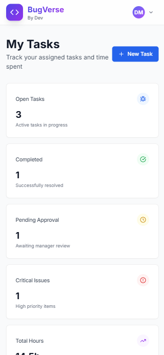
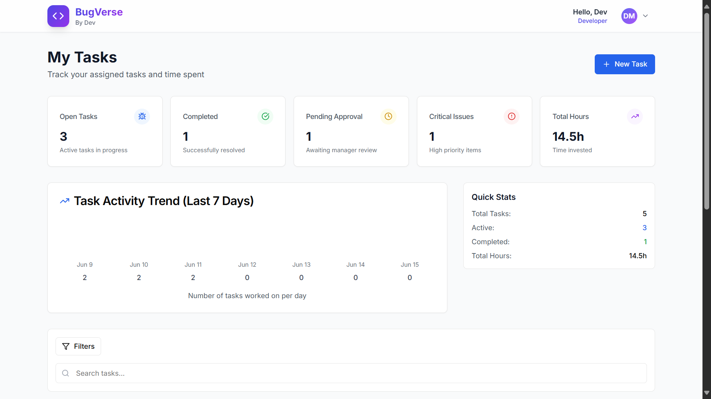

# Bugverse-frontend
A modern, responsive task and bug tracking application built with Next.js, TypeScript, and Tailwind CSS. This is a frontend demo showcasing a complete task management system with beautiful UI/UX design.


## ✨ Features

- **Modern UI/UX**: Glassmorphism design with smooth animations
- **Role-based Access**: Developer and Manager views with different permissions
- **Task Management**: Create, edit, delete, and track tasks with priorities
- **Time Tracking**: Log time spent on tasks with detailed entries
- **Status Workflow**: Open → In Progress → Pending Approval → Closed
- **Filtering & Search**: Advanced filters for status, priority, type, and assignee
- **Dashboard Analytics**: Task trends, statistics, and progress tracking
- **Responsive Design**: Optimized for desktop, tablet, and mobile devices

## 🚀 Installation

### Prerequisites

- Node.js 16.x or higher
- npm or yarn package manager

### Setup Instructions

1. **Clone the repository**
   ```bash
   git clone <repository-url>
   cd bugverse
   ```

2. **Install dependencies**
   ```bash
   npm install
   # or
   yarn install
   ```

3. **Start the development server**
   ```bash
   npm run dev
   # or
   yarn dev
   ```

4. **Open your browser**
   Navigate to `http://localhost:3000`

### Build for Production

```bash
npm run build
npm start
```

## 🔐 Demo Credentials

The application includes two demo accounts for testing different user roles:

### Developer Account
- **Email**: `dev@company.com`
- **Password**: `password123`
- **Role**: Developer
- **Access**: Can view assigned tasks, log time, and update task status

### Manager Account
- **Email**: `DJ@company.com`
- **Password**: `password123`
- **Role**: Manager
- **Access**: Full access to all tasks, can approve/reject tasks, view team analytics

## 📱 Screenshots

### Desktop View



### Mobile View



## 📋 Project Structure

```
bugverse/
├── app/                    # Next.js app directory
│   ├── dashboard/         # Dashboard page
│   ├── globals.css        # Global styles
│   ├── layout.tsx         # Root layout
│   └── page.tsx          # Home/login page
├── components/            # React components
│   ├── auth/             # Authentication components
│   ├── dashboard/        # Dashboard components
│   ├── layout/           # Layout components
│   ├── tasks/            # Task management components
│   └── ui/               # Reusable UI components
├── lib/                  # Utility libraries
│   ├── auth.ts           # Authentication logic
│   ├── tasks.ts          # Task management logic
│   └── utils.ts          # Helper utilities
└── public/               # Static assets
```
